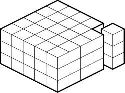

.. title:: Programming guide - Introduction
.. include:: common.rst

Introduction
============

What is DANA ?
--------------

Computational neuroscience is a vast domain of research going down from the
very precise modeling of a single spiking neuron, taking into account ion
channels and/or dendrites spatial geometry up to the modeling of very large
assemblies of simplified neurons that are able to give account of complex
cognitive functions. DANA attempts to address this latter modeling activity by
offering a python computing framework for the design of very large assemblies
of neurons using numerical and distributed computations. However, there does
not exist something as a unified model of neuron: if the formal neuron has been
established some sixty years ago, there exists today a myriad of different
neuron models that can be used within an architecture. Some of them are very
close to the original definition while some others tend to refine it by
providing extra parameters or variables to the model in order to take into
account the great variability of biological neurons. DANA makes the assumption
that a neuron is essentially a set of numerical values that can vary over time
due to the influence of other neurons and learning. DANA aims at providing a
constrained and consistent python framework that guarantee this definition to
be enforced anywhere in the model, i.e., no symbol, no homonculus, no central
executive.

Concepts
--------

The computational paradigm supporting the DANA framework is grounded on the
notion of a unit that is a set of arbitrary values that can vary along time
under the influence of other units and learning. Each unit can be linked to any
other unit (including itself) using a weighted link and a group is a structured
set of such homogeneous units.

  
   **Figure 1** - DANA basic concepts

More formally, we can write the following definitions:

* A unit is a set of one to several values (Vᵢ, i ∈ ℕ).
* A group is a structured set of one to several homogeneous units.
* A layer is a subset of a group restricted to a unique value Vᵢ.
* A layer is a group.
* A link is a weighted connection between a source unit towards a target unit.
* Target groups own their links.
* A group can be linked to any other group value including itself.

The DANA framework offers a set of core objects needed to design and run such
models. However, what is actually computed by a unit and what is learned is the
responsibility of the modeler who is in charge of describing the equation
governing the behavior of units groups over time and/or learning.
