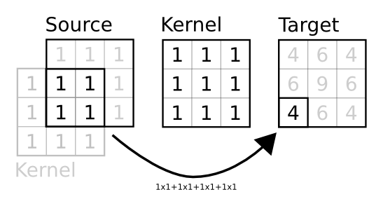

.. currentmodule:: dana

===============================================================================
Connections                                                                    
===============================================================================

.. only:: html

   .. contents::
      :local:
      :depth: 2

A connection can be made between two groups (a source and a target that can be
the same) in order to model the propagation of activity from one group to the
other. Any connection is evaluated prior to the target group evaluation such
that the output of the connection is made available within the group equations.

Creating a connection                                                          
===============================================================================
Creating a connection ``C`` between a ``source`` and a ``target`` using a
specified ``kernel`` is straightforward::

    >>> source = np.ones((2,2))
    >>> target = np.ones((3,3))
    >>> kernel = np.ones((target.size,source.size))
    >>> C = Connection(source,target,kernel)

``C`` now represents the connection between source and target and we can get
``C`` output by calling the ``output`` function:

    >>> print C.output()
    [[ 4.  4.  4.]
     [ 4.  4.  4.]
     [ 4.  4.  4.]]

This output is computed by multiplying the source vector by the matrix
kernel. However, in the example above, the source is not a vector but a matrix
of shape 2×2. To be able to carry out the multiplication, this source is thus
flattened into a vector of dimension 4 (= 2×2) and multiplied by the kernel
matrix. Since the size of the kernel matrix is 9×4, the output should be a
vector of dimension 9. But we know the target group, and more specifically, we
know its shape. The output of the connection is thus automatically reshaped
such that the shape of the connection output match the shape of the target (3×3
in this case).

Using a connection                                                             
===============================================================================
The automatic reshaping of the output is critical if it is to be used within a
group equation. But before even creating a connection between two groups, we
have to decide which field of the target group will receive the output of the
connection. This field should be specified as a :ref:`declaration` as in the
following example where field ``I`` of ``target`` is supposed to receive the
connection output.

    >>> source = np.ones((2,2))
    >>> target = zeros((3,3), 'V = I; I')
    >>> kernel = np.ones((target.size,source.size))
    >>> C = Connection(source, target('I'), kernel)

We could display the result as it has been made in the previous example the
connection output but instead, we'll use the ``propagate`` method that first
compute the output of the connection and then store the result within the
specified field of the target (``I`` in this case)::

    >>> C.propagate()
    >>> print target.I
    [[ 4.  4.  4.]
     [ 4.  4.  4.]
     [ 4.  4.  4.]]

The most interesting point of suchconnections where the target is a group is
that the output can be used within the group equations::

    >>> source = np.ones((3,3))
    >>> target = zeros((3,3),'V = V+I; I')
    >>> kernel = np.eye(9)
    >>> C = DenseConnection(source, target('I'), kernel)

In this example, the value of V is computed by adding I to the current value.
If we run this simple model for 5 iterations, we get::

    >>> run(n=5)
    >>> print target.V
    [[ 5.  5.  5.]
     [ 5.  5.  5.]
     [ 5.  5.  5.]]    

Topology                                                                       
===============================================================================
A group does not have a topology *per se*. Even if a shape is specified at
group creation, this is mainly used to display it, either on terminal or in a
figure. In all of the above examples, we created connections using the full
matrix of weights (``kernel``) specifying individual weight between any source
and target unit without further consideration on any possible neighborhood
relationship.  However, a group may acquire some topology when connected with
another group (or itself) if the given kernel has a different shape as
illustrated below::

    >>> source = np.ones((3,3))
    >>> target = np.ones((3,3))
    >>> kernel = np.ones((3,3))
    >>> C = Connection(source, target, kernel)
    >>> print C.output
    [[ 4.  6.  4.]
     [ 6.  9.  6.]
     [ 4.  6.  4.]]    

.. note::

   It is possible to have toric connections by specifying toric=True when
   Connection is created

In this case, the given kernel is interpreted as a prototype kernel for a
single target unit that is to be used for every other unit. To do this, when
the connection is created, a new matrix is built such that any target unit
receives the output of the prototype kernel multiplied by the source unit and
its immediate neighborood (that span the kernel size) as illustrated on the
figure below.

The figure shows how the output of target unit at position (2,0) is computed
according to the prototype kernel. First, the shape of the target is used to
assign a set of normalized coordinates to the unit and these normalized
coordinates are used to find the corresponding source unit. The prototype
kernel is then centered on this unit and a element wise multiplication is
performed where kernel and source overlaps they are sumed up and stored at the
target unit position within the target group. When source and target have the
same shape, this is strictly equivalent to a convolution.

All built-in dana connections are built on the same principles but you are free
to give the full connection matrix of create your own Connection class to
override this behavior.

Connection types                                                               
===============================================================================
dana offers three different types of connections that have different properties
and speed (for evaluating them). In the following, we'll consider a source
group of size 2×2 and a target group of size 2×2 and a kernel of size 1×1::

    >>> source = np.ones((2,2))
    >>> target = np.ones((2,2))
    >>> kernel = np.ones((1,1))

Dense connection                                                               
-------------------------------------------------------------------------------
This is the more generic connection. The underlying matrix is a regular numpy
array of size (target.size, source.size). If your two groups are fully
connected with no regular patterns in links, you have to use this type of
connection::

    >>> C = DenseConnection(source,target.kernel)
    >>> print C.weights
    [[ 1.  0.  0.  0.]
     [ 0.  1.  0.  0.]
     [ 0.  0.  1.  0.]
     [ 0.  0.  0.  1.]]

Shared connection                                                              
-------------------------------------------------------------------------------

.. warning::

   Shared connection cannot learn.

If source/target shape are both one- or two-dimensional, the output of the
connection can be computed using a convolution. If the kernel is separable,
this makes computation to be really faster compared to the dense connection
type. dana takes care of the case where source and target have same
dimensionality but not the same size::

    >>> C = SharedConnection(source,target.kernel)
    >>> print C.weights
    [[ 1. ]]

Sparse connection                                                              
-------------------------------------------------------------------------------
If you have only a few connection between two groups, you might consider using
this type of connection that is built on top of scipy sparse matrix that saves
a lot of unnecessary computations when a matrix is mainly filled with zeros::

    >>> C = SparseConnection(source,target.kernel)
    >>> print C.weights
    (0, 0)        1.0
    (1, 1)        1.0
    (2, 2)        1.0
    (3, 3)        1.0
