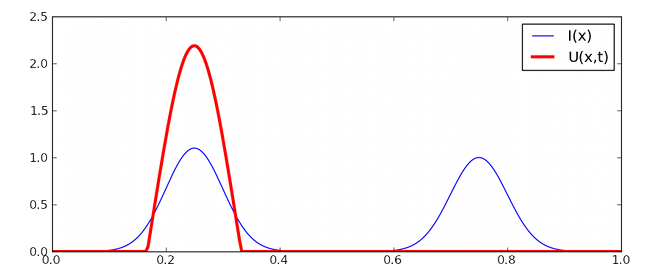

.. currentmodule:: dana

===============================================================================
Examples                                                                       
===============================================================================

.. only:: html

   .. contents::
      :local:
      :depth: 1

Image processing                                                               
===============================================================================
A lot of standard image processing technics are based upon homogeneous
convolution of individual pixels with surrounding regions (`Gaussian blur
<http://en.wikipedia.org/wiki/Gaussian_blur>`_, `Sobel operator
<http://en.wikipedia.org/wiki/Sobel_operator>`_, `Cross operator
<http://en.wikipedia.org/wiki/Roberts_Cross>`_, etc.). Dana is perfectly suited
for such technics offering easy manipulation of kernel functions.  We'll use
the `Imaging <http://www.pythonware.com/products/pil/>`_ library to load the
standard lena image into a numpy array. The shape of the array is either
width×height for gray-level images or width×height×[3,4] for color images (RGB
or RGBA)::

    >>> import Image
    >>> image = np.asarray(Image.open('lena.png'))/256.0
    >>> I = image.view(dtype=[('R',float), ('G',float), ('B',float)]).squeeze()
    >>> L = (0.212671*I['R'] + 0.715160*I['G'] + 0.072169*I['B'])

   **Figure** Original lena image, blur filter and Sobel filter.

Sobel operator
--------------
The Sobel operator is used for edge detection and is based upon a
differentiation operator that approximate the gradient of the image
intensity. Technically, this is made using two convolutions (one horizontal and
one vertical) with a minimal size kernel (3×3) to get local gradients from
which we can compute the gradient magnitude::

    >>> src = Group(I.shape, 'V = sqrt(Gx**2+Gy**2); Gx; Gy')
    >>> Kx = np.array([[-1., 0.,+1.],
                       [-2., 0.,+2.],
                       [-1., 0., 1.]])
    >>> Gx = SharedConnection(L, src('Gx'), Kx)
    >>> Ky = np.array([[+1.,+2.,+1.],
                       [ 0., 0., 0.],
                       [-1.,-2.,-1.]])
    >>> Gy = SharedConnection(L, src('Gy'), Ky)  
    >>> src.run(n=1)

Gaussian blur
-------------
Gaussian blur is based upon the convolution of the image using a Gaussian
kernel. In the example below, we use a 5×5 Gaussian kernel and we apply it on
the three channels::

    >>> G = gaussian((10,10),.5)
    >>> K = G/G.sum()
    >>> SharedConnection(I['R'], I['R'], K).propagate()
    >>> SharedConnection(I['G'], I['G'], K).propagate()
    >>> SharedConnection(I['B'], I['B'], K).propagate()

Cellular automata                                                              
===============================================================================
Have a look at the chapter :doc:`numpy-to-dana` for a commented implementation
of the game of life.

Diffusion process                                                              
===============================================================================
Have a look at the chapter :doc:`quicktour` for a commented implementation
of a diffusion process.

Dynamic neural fields                                                          
===============================================================================

Dynamic neural fields describe the spatio-temporal evolution of a population of
neurons seen as a spatial continuum. These models have been extensively studied
in [Wilson:1972]_ , [Wilson:1973]_, [Amari:1977]_ and [Taylor:1999]_ extended
these studies in the two-dimensional case. We will use notations introduced by
Amari where a neural position is labelled by a vector x.

.. math::

   \frac{1}{\alpha} \frac{\partial U(x,t)}{\partial t} = -u(x,t) +
   \int_{-\infty}^{+\infty}W(|x-y|)~f[U(y)]dy + h + I(x,t)

with
  * U(x,t) is the potential of a neural population at position x and time t.
  * W(x) is a neighborhood function
  * f(x) is the firing rate of a single neuron.
  * α is the temporal decay of the synapse.
  * h is the resting potential
  * I(x,t) is the input at position x

Usually, the neighborhood function W is a difference of Gaussian
(a.k.a. Mexican hat) with short range excitations and long range-inhibitions.

We begin by setting simulation parameters::

    >>> n = 256
    >>> t, dt = 10.0, 0.01
    >>> alpha = 1.0

We create the input (I) and neural field groups::

    >>> I   = np.zeros((n,))
    >>> DNF = Group((n,), '''dU/dt = (-V + 0.1*L + I);
                              V    = maximum(U,0); I; L''')

and we connect the input to the neural field and the neural field to itself::

    >>> SparseConnection(I, DNF('I'), np.ones((1,)))
    >>> SharedConnection(DNF('V'), DNF('L'), +1.00*gaussian(2*n+1, 0.10)
                                             -0.75*gaussian(2*n+1, 1.00))

Finally, we setup some input and we run the model::

    >>> I[...] = 1.1*gaussian(n, 0.1, -0.5) + 1.0*gaussian(n, 0.1, +0.5)
    >>> run(t=10.0, dt=0.1)

References
----------

.. [Amari:1977] S.-I. Amari, *Dynamic of pattern formation in
                lateral-inhibition type neural fields*,
                Biological Cybernetics, 27:77-88, 1977.

.. [Wilson:1972] H.R. Wilson and J.D. Cowan *Excitatory and inhibitory
                 interactions in localized populations of model neurons*,
                 Biophysical Journal, 12:1-24, 1972.

.. [Wilson:1973] H.R. Wilson and J.D. Cowan. *A mathematical theory of the
                 functional dynamics of cortical and thalamic nervous tissue.*
                 Kybernetik, 13:55–80, 1973.

.. [Taylor:1999] J.G. Taylor *Neural bubble dynamics in two dimensions:
                 foundations*, Biological Cybernetics, 80:5167-5174, 1999.

