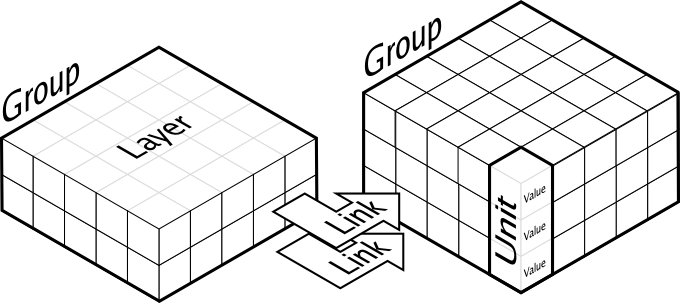

===============================================================================
Introduction                                                                   
===============================================================================

.. only:: html

   .. contents::
      :local:
      :depth: 1

Computational neuroscience is a vast domain of research going down from the
very precise modeling of a single spiking neuron, taking into account ion
channels and/or dendrites spatial geometry up to the modeling of very large
assemblies of simplified neurons that are able to give account of complex
cognitive functions. Dana attempts to address this latter modeling activity by
offering a python computing framework for the design of very large assemblies
of neurons using numerical and distributed computations. The computational
paradigm supporting the dana framework is grounded on the notion of a unit that
is a essentially a set of arbitrary values that can vary along time under the
influence of other units and learning. Each unit can be connected to any other
unit (including itself) using a weighted link and a group is a structured set
of such homogeneous units.

----

More formally, we can write the following definitions:

* A unit is a set of one to several values, each of them being potentially
  described by an equation.
* A group is a structured set of one to several homogeneous units.
* A layer is a subset of a group restricted to a unique value.
* A layer is a group.
* A connection links a source layer to a target layer and may have an equation
  describing its evolution along time according to source and target.
* A group can be connected to any other group value including itself.

The dana framework offers a set of core objects needed to design and run such
models. However, what is actually computed by a unit and what is learned is the
responsibility of the modeler who is in charge of describing all equations
governing the behavior of units groups and connections over time and learning.

Motivations                                                                    
-------------------------------------------------------------------------------

Let us consider how learning takes place in the multi-layer perceptron with the
back-propagation learning rule. This learning rule requires first to compute
the activities of each layer in a feed-forward way (to get the output) and then
to apply the learning rule backwards. This implicitly requires a supervisor
that is able to coordinate the different layers between them, to compute the
error between the obtained and desired output and to back-propagate it. The
problem, in our sense, is that this supervisor has not been made explicit and
has not been instantiated within the model (e.g. by a group of dedicated
neurons). This means that part of the properties of the system are indeed
introduced by the supervisor, without specifying how the supervisor itself is
controlled. This also means that one would not be able to reproduce this
network using, for instance, only hardware artificial neurons linked together
without introducing an ad-hoc surrounding architecture for the coordination of
the network. More generally, this kind of artefact is widely spread in the
connectionnist and computational neuroscience literature. The question is to
decide to what extent these artefacts can impact results and claims. We will
not answer the general case, but, in the context of the study of emergence, we
want to strongly constrain our modeling framework such that we won't have such
artefacts and what may emerge from our models may be considered a real
emergent property of the model.

What can I do with DANA ?                                                      
-------------------------------------------------------------------------------

Dana has been designed in the first place for computational neuroscience.
However, because of the structure of the framework, it might be possible to use
dana other scientific models as well. You might for example have a look at the
:doc:`examples` chapter that introduces models dealing with cellular automaton
and image processing.

What can I not do with DANA ?                                                  
-------------------------------------------------------------------------------
If you model possess something like a central supervisor or any kind of ordered
evaluation, then you  cannot use DANA to implement your  model. As explained in
the  introduction,  DANA makes  no  distinction  between  groups and  they  are
evaluated in random order. Because  of this restriction, you cannot for example
implement a `multi-layer perceptron <http://en.wikipedia.org/wiki/Perceptron>`_
(because of  the feed-forward evaluation  and backward learning) or  a `Kohonen
network   <http://en.wikipedia.org/wiki/Kohonen>`_  (because  of   the  central
supervisor deciding which unit won the competition).
