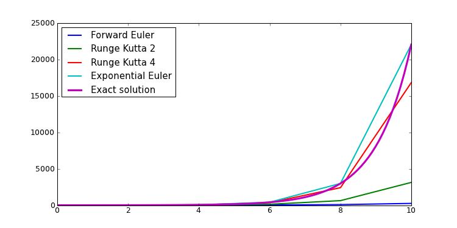

.. currentmodule:: dana

===============================================================================
Model and equations                                                            
===============================================================================
.. contents::
   :local:
   :depth: 2

Beyond the quite limited group dtype argument, a group can also be created
using a Model_ that allow to finely tune the behavior of each field of the
group. Let us consider the following example::

   >>> import Image
   >>> image = np.asarray(Image.open('lena.jpg'))/256.0
   >>> I = image.view(dtype=[('r',float), ('g',float), ('b',float)]).squeeze()
   >>> G = dana.Group(I.shape,
                      model = '''r; g; b; l = 0.212671*r + 0.715160*g + 0.072169*b''')
   >>> G.r, G.b ,G.b = I.r, I.g, I.b

G is now a group with 3 regular fields (``r``, ``g`` and ``b``) and a fourth
one (``l`` for luminance) that has been defined as a function of the three
other fields. If one wants to compute the output of this specific field, one
has to simply run the group::

   >>> G.run(n=1)

It is to be noted that the ``l`` field is not automatically updated when other
fields change since we'll see below that we actually need finer control over
evaluation. More generally, a model can be built using either a `Declaration`_,
an `Equation`_ or a `Differential Equation`_ or any combination as described
below.

.. _declaration:

Declaration                                                                    
-------------------------------------------------------------------------------
A declaration is a way to declare the existence of a variable to dana. As such,
it is not terribly useful when it is used on its own::

   >>> eq = Declaration('X')

You can evaluate this declaration by giving the current value of ``X`` and
quite surprisingly, you get the value of ``X``::

   >>> print eq(X=1)
   1

When considering a group, a declaration allows to declare the existence of a
variable to the group. In this sense, it is quite similar to the dtype syntax
where you specify the name of the field and its type. The type of a variable is
restricted to scalar types such as bool, int, float and double or any valid numpy
scalar types (e.g. np.int32, np.float64, etc)::

   >>> G = dana.Group((3,3), dtype = [('x', float), ('y', float)])

or (strictly equivalent)::

   >>> G = dana.Group((3,3), model = 'x : float; 'y' : float')

Equation                                                                       
-------------------------------------------------------------------------------
An equation describes how a given variable is updated when the equation is
called. The name of the variable is given by the left-hand side of the equation
and the update function is represented by the right-hand side of the equation.
Let us consider for example the following equation::

   >>> eq = Equation('X = X+1')

It specifies that when equation is called with a ``X`` argument, it returns
``X+1``. We can evaluate this equation most simply by making a call to the
equation::

   >>> print eq(X=1)
   2

Of course, you can have more complex equations with many variables and any
numpy function::

   >>> eq = Equation('X = X+a**2+b')

In such a case, any variables in the right hand side of the equation must be
specified when calling the equation. You can choose to name those variables::

   >>> print eq(X=1, b=0.1, a=0.5)
   1.35

or to specify them in the order they appear in the equation (X,a,b in this
case)::

   >>> print eq(1, 0.5, 0.1)
   1.35

.. note::

   Since ``a`` and ``b`` have not been specified, it is assumed they are equal
   to zero.

One interesting point is that you can also call the equation with numpy arrays
as arguments::

   >>> eq = Equation('X = X+2')
   >>> print eq(X=np.ones((2,2))
   [[ 3.  3.]
    [ 3.  3.]]

Differential Equation                                                          
-------------------------------------------------------------------------------
A differential equation represents first order ordinary differential equation
of the form *dy/dt = f(y,t)* and describes how a given variable is updated when
the equation is called. The name of the variable is given by the left-hand side
of the equation and the update function is represented by the right-hand side
of the equation.  Let us consider for example the following equation::

   >>> eq = DifferentialEquation('dX/dt = 1')

.. note::

   Default integration method for differential equations is the forward Euler
   method.

It specifies that when equation is called with a ``X`` argument, it returns
``X+dX``. We can evaluate this equation most simply by making a call to the
equation::

   >>> X = 1
   >>> dt = 0.1
   >>> print eq(X,dt)
   1.1

There exists several methods to integrate such differential equation within
dana. The fastest is probably the forward Euler method that can give pretty
good results as long as your equation is not too stiff as illustrated below
(see `Wikipedia
<http://en.wikipedia.org/wiki/Numerical_ordinary_differential_equations>`_
entry for more informations).

However, if your differential equation is of the form *x = A - Bx* (which is
pretty common in computational neuroscience), you probably better use the
exponential Euler integration method that give both fast and accurate results.

If you want to change the integration method, you do it as follows::

   >>> eq.select('Runge Kutta 2')

Available methods are:

* "Forward Euler"
* "Runge Kutta 2"
* "Runge Kutta 4"
* "Exponential Euler"

Model
-----

All the above can now be used in a model that is a container for a set of
declaration, equation and differential equations that are evaluated at once
when the model is ran. Construction is straightforward::

    >>> model = Model('dx/dt = y; y = z+1; z')

Here the model possesses a differential equation (*x*), an ordinary equation
(*y*) and a declaration (*z*). This can be checked most easily by printing the
model::

    >>> print model
    DifferentialEquation('dx/dt = Y : float')
    Equation('y = z+1 : float')
    Declaration('z : float')

To run the model, we need a dictionnary of variables that represent the initial
state::

    >>> x,y,z = 1,1,1
    >>> vars = {'x' : x, 'y' : y, 'z' : z}

We can then use this dictionnay to give the initial state to the model and run
it for exactly *dt* seconds::

    >>> model.run(vars, dt=0.1)
    {'x': 1.1, 'y': 2, 'z':1}

.. warning::

   Be careful of using distinct numpy arrays for model variables or the result
   will be undefined.

Instead of scalar variables, you can also use numpy arrays as long as their
shape are homogeneous:

    >>> x,y,z = np.ones(3), np.ones(3), np.ones(3)
    >>> vars = {'x' : x, 'y' : y, 'z' : z}
    >>> model.run(vars, dt=0.1)
    {'x': array([ 1.1,  1.1,  1.1]),
     'y': array([ 2.,  2.,  2.]),
     'z': array([ 1.,  1.,  1.])}
    

