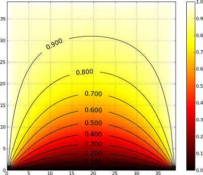

.. currentmodule:: dana

===============================================================================
Quick tour                                                                     
===============================================================================

.. only:: html

   .. contents::
      :local:
      :depth: 1

Getting started  with a  new library or  framework can be  daunting, especially
when presented with a large amount  of reference material to read. This chapter
gives a very quick introduction to dana without covering any of the details.

First steps                                                                    
===============================================================================

Begin by importing the dana package::

  >>> from dana import *

and create a new group of 100 units with a set of definitions::

  >>> G = zeros(100,'''r; theta;
                       x = r*sin(theta)
                       y = r*cos(theta)''')

Those definitions represent the underlying model of the group that can be
evaluated by invoking the :meth:`Group.run` method. Let us now affect some
random values to ``r`` and ``theta``::

  >>> G.r = np.random.random(100)
  >>> G.theta = 2*np.pi*np.random.random(100)

If we run the group for exactly one iteration, ``x`` and ``y`` fields will be
updated according to their respective definition::

  >>> G.run(n=1)

We can display some ``x`` and ``y`` values of the group::

  >>> x,y,r,theta = G.x[0], G.y[0], G.r[0], G.theta[0]
  >>> print r, theta
  0.496258902417 2.8709367177
  >>> print x, y
  0.132681542455 -0.478192959504

And check they are equal to their definition::

  >>> print r*np.sin(theta), r*np.cos(theta)
  0.132681542455 -0.478192959504

Basic concepts
===============================================================================
Groups are the central objects of the DANA framework and most of the modeling
work relates to the definition of a group model which is a set of generic
definitions of variables. Such definitions can be a simple declaration of a new
variable, an equation defining how to compute the variable (with regards to
other variables) or a differential equation defining how to update the variable
at each timestep. Let us for example consider the case of a uniform accelerated
solid (`\frac{dx}{dy} = v`, `frac{dv}{dt} = a`). Considering the initial state
`(x_0, y_0)` we can easily compute the exact solution `x(t) = \frac{1}{2}at^2 +
v_0t + x_0`.

Simulating such a simple system using DANA is straightforward::

  >>> x0, v0, a = 1.0, 2.0, 3.0
  >>> t, dt = 1.0, 0.01
  >>> G = zeros(1, 'dx/dt=v; dv/dt=a')
  >>> G.x, G.v = x0, v0
  >>> t,dt = 1.0, 0.01
  >>> run(t=t, dt=dt)
  >>> print G.x[0]
  4.485

.. note:: The error comes from both the numerical integration and the default
          integration method which is the forward Euler.

And we can check the difference with the theoretical solution::

  >>> print 0.5*a*t**2 + v0*t + x0
  4.5
  

Connecting groups                                                              
===============================================================================
So far, DANA  is not very different from (a  quite primitive) integration tools
allowing for the  numerical integration of a set  of equations and differential
equations. However, one  of the strenght of DANA is  the possibility to connect
groups together allowing them to interact in possibly tricky ways.

Let us consider for example the heat equation which describe the distribution
of heat (or variation in temperature) in a given region over time. For a
function u(x,y,t) of two spatial variables (x,y) and a time variable t, the
heat equation is given by `\frac{\partial{u}}{\partial{t}} = k\nabla^2u where k is a
constant. The numerical solution can be approximated using various methods such
as the explicit, implicit or Crank-Nicolson methods. We'll use the explicit
method in our implementation and write the heat equation using the forward
difference/central difference (FCTS) equation::

  >>> n = 50
  >>> k = 5
  >>> G = dana.zeros((n,n), 'dV/dt = k*(N/4-V); N')

We can connect this group to itself such that each group unit is connected to its
four neighbours::

  >>> K = np.zeros((3,3))*np.NaN
  >>> K[0,1] = K[1,0] = K[1,2] = K[2,1] = 1
  >>> print K
  [[ nan  1. nan ]
   [  1. nan  1. ]
   [ nan  1. nan ]]
  >>> SparseConnection(G('V'), G('N'), K)

The group field ``N`` now represents the weighted sum of neighbouring
activities.  Now, we can simulate the model for ten minutes , keeping left,
right and up border at temperature 1 while bottom border is kept at
temperature 0.

  >>> t, dt = 600.0, 0.1
  >>> for i in range(int(t/dt))):
  ...     G.evaluate(dt=dt)
  ...     G.V[0,:] = 0 
  ...     G.V[:,n-1] = G.V[n-1,:] = G.V[:,0] = 1

And we can observe the final temperature on the figure below:

Where to next ?                                                                
===============================================================================
The examples presented in this chapter should have given you enough information
to get started writing simple simulations.

The remainder of this book goes into more technical details regarding some of
DANA's features. While getting started, it's recommended that you skim the
beginning of each chapter but not attempt to read through the entire guide from
start to finish.

There  are  also  numerous  examples  of DANA  applications  in  the  examples/
directory  of  the  documentation   and  source  distributions.  Keep  checking
http://dana.loria.fr/ for more examples and tutorials as they are written.
