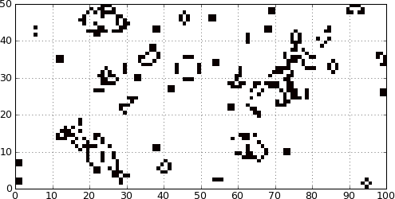

.. _game_of_life:
.. highlight:: none

===============================================================================
The game of Life                                                               
===============================================================================

Even if DANA is slanted toward computational neuroscience, we'll consider in
this quicktour the `game of life
<http://en.wikipedia.org/wiki/Conway's_Game_of_Life>`_ by John Conway which is
one of the earliest example of cellular automata. In fact, cellular automata
can be considered as a group of cells that are linked together through the
notion of neightbours. We'll show implementation of this game using pure
python, numpy and dana to illustrate main concepts of DANA.

Definition
==========
(**from wikipedia**)

The Game of Life, also known simply as Life, is a cellular automaton devised
by the British mathematician John Horton Conway in 1970.  It is the
best-known example of a cellular automaton. The "game" is actually a
zero-player game, meaning that its evolution is determined by its initial
state, needing no input from human players. One interacts with the Game of
Life by creating an initial configuration and observing how it evolves.*

The universe of the Game of Life is an infinite two-dimensional orthogonal grid
of square cells, each of which is in one of two possible states, live or
dead. Every cell interacts with its eight neighbours, which are the cells that
are directly horizontally, vertically, or diagonally adjacent. At each step in
time, the following transitions occur:*

- Any live cell with fewer than two live neighbours dies, as if by needs
  caused by underpopulation.
- Any live cell with more than three live neighbours dies, as if by
  overcrowding.
- Any live cell with two or three live neighbours lives, unchanged, to the
  next generation.
- Any dead cell with exactly three live neighbours becomes a live cell.

The initial pattern constitutes the 'seed' of the system.  The first generation
is created by applying the above rules simultaneously to every cell in the seed
– births and deaths happen simultaneously, and the discrete moment at which
this happens is sometimes called a tick. (In other words, each generation is a
pure function of the one before.)  The rules continue to be applied repeatedly
to create further generations.*

The way of python                                                              
===============================================================================
In pure python, we can code the Game of Life using a list of lists representing
the board where cells are supposed to evolve::

   >>> Z = [[0,0,0,0,0,0],
            [0,0,0,1,0,0],
            [0,1,0,1,0,0],
            [0,0,1,1,0,0],
            [0,0,0,0,0,0],
            [0,0,0,0,0,0]]

This board possesses a ``0`` border that allows to accelerate things a bit by
avoiding to have specific tests for borders when counting the number of
neighbours. To iterate one step in time, we simply count the number of
neighbours for each internal cell and we update the whole board according to
the Game of Life rules::

   def iterate(Z):
       shape = len(Z), len(Z[0])
       N  = [[0,]*(shape[0]+2)  for i in range(shape[1]+2)]
       # Compute number of neighbours for each cell
       for x in range(1,shape[0]-1):
           for y in range(1,shape[1]-1):
               N[x][y] = Z[x-1][y-1]+Z[x][y-1]+Z[x+1][y-1] \
                       + Z[x-1][y]            +Z[x+1][y]   \
                       + Z[x-1][y+1]+Z[x][y+1]+Z[x+1][y+1]
       # Update cells
       for x in range(1,shape[0]-1):
           for y in range(1,shape[1]-1):
               if Z[x][y] == 0 and N[x][y] == 3:
                   Z[x][y] = 1
               elif Z[x][y] == 1 and not N[x][y] in [2,3]:
                   Z[x][y] = 0
       return Z

Finally, we iterate 4 steps in time and we check the `glider
<http://en.wikipedia.org/wiki/Glider_(Conway's_Life)>`_ has glided one step
down and right::

   >>> for i in range(4): iterate(Z)
   >>> print Z
   [[0, 0, 0, 0, 0, 0],
    [0, 0, 0, 0, 0, 0],
    [0, 0, 0, 0, 1, 0],
    [0, 0, 1, 0, 1, 0],
    [0, 0, 0, 1, 1, 0],
    [0, 0, 0, 0, 0, 0]]

The way of numpy                                                               
===============================================================================
Using numpy, we can benefit from vectorized computation and accelerates things
a lot. The board can now be represented using a numpy array::

   >>> import numpy
   >>> Z = numpy.array ([[0,0,0,0,0,0],
                         [0,0,0,1,0,0],
                         [0,1,0,1,0,0],
                         [0,0,1,1,0,0],
                         [0,0,0,0,0,0],
                         [0,0,0,0,0,0]])

This board possesses a ``0`` border that allows to accelerate things a bit by
avoiding to have specific tests for borders when counting the number of
neighbours. To iterate one step in time, we count the number of neighbours for
all internal cells at once and we update the whole board according to the Game
of Life rules::

   def iterate(Z):
       # find number of neighbours that each square has
       N = numpy.zeros(Z.shape)
       N[1:, 1:] += Z[:-1, :-1]
       N[1:, :-1] += Z[:-1, 1:]
       N[:-1, 1:] += Z[1:, :-1]
       N[:-1, :-1] += Z[1:, 1:]
       N[:-1, :] += Z[1:, :]
       N[1:, :] += Z[:-1, :]
       N[:, :-1] += Z[:, 1:]
       N[:, 1:] += Z[:, :-1]
       # a live cell is killed if it has fewer than 2 or more than 3 neighbours.
       part1 = ((Z == 1) & (N < 4) & (N > 1)) 
       # a new cell forms if a square has exactly three members
       part2 = ((Z == 0) & (N == 3))
       return (part1 | part2).astype(int)

Finally, we iterate 4 steps in time and we check the `glider
<http://en.wikipedia.org/wiki/Glider_(Conway's_Life)>`_ has glided one step
down and right::

   >>> for i in range(4): iterate(Z)
   >>> print Z[1:-1]
   [[0 0 0 0]
    [0 0 0 1]
    [0 1 0 1]
    [0 0 1 1]]

The way of dana                                                                
===============================================================================
As for numpy, the first things to do is to create a :class:`Group` for holding
our cells. Howver, instead of simply declaring group dtype, we can directly give
the equation governing each value such that:

* *V* represents the current state of a cell
* *N* is the number of active neighbours

According to the game of life rules, we know that:

* every cell with less than 1 neighbours must die: (N<1.5)
* every cell with more than 4 neighbours must die: (N>3.5)
* every dead cell with less than 3 neighbours must die: (N<2.5)*(1-state)
* every other cell remains unchanged.

Thus, we declare Z as::

   >>> Z = Group((4,4), '''V = maximum(0,1.0-(N<1.5)-(N>3.5)-(N<2.5)*(1-V)) : int
                           N : float''')

This group is now made of 4x4 cells, each of them having a two values named *V*
and *N*. The first value *V* has been specified using an :class:`Equation`
while the second is a simple :class:`Declaration` that will be a placeholder
for the connection output.

Next, we initialize the *V* value with the glider pattern::

   >>> Z.V = np.array([[0,0,1,0],
                       [1,0,1,0],
                       [0,1,1,0],
                       [0,0,0,0]])

Each cell now needs to be connected to its immediate neighbours and this can be done
by using a :class:`Connection` to connect *Z* to itself::
 
   >>> C = SharedConnection(Z('V'), Z('N'),
                            np.array([[1., 1., 1.], 
                                      [1., 0., 1.], 
                                      [1., 1., 1.]]))

Cells are now linked to their immediate neighbours using a (shared) connection
that will output in the *N* field in *Z*. This connection represents the
weighted sum of cell *state* activity using given array.  Since array values
are either 0 or 1 and cell states are either 0 or 1 , the weighted sum actually
represents the number of live cells in the immediate neighboorhood.

Finally, we iterate 4 steps in time and we check the `glider
<http://en.wikipedia.org/wiki/Glider_(Conway's_Life)>`_ has glided one step
down and right::

   >>> run(n=4)
   >>> print Z
   [[0 0 0 0]
    [0 0 0 1]
    [0 1 0 1]
    [0 0 1 1]]

Sources                                                                        
===============================================================================

* `game-of-life_numpy.py <_static/game-of-life_numpy.py>`_
* `game-of-life_python.py <_static/game-of-life_python.py>`_
* `game-of-life_dana.py <_static/game-of-life_dana.py>`_

