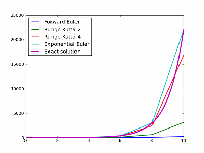

.. _tutorial:
.. highlight:: none

===============================================================================
Tutorial                                                                       
===============================================================================
This tutorial assumes you're familiar with with python and numpy. If this is
not the case, please have a look at `External resources`_ section. For brevity
and convenience, we assume that the main packages (dana, numpy, scipy, and
matplotlib) have been imported as::

   >>> import dana
   >>> import numpy as np
   >>> import matplotlib as mpl
   >>> import matplotlib.pyplot as plt

An alternative way is::

   >>> from dana import *

that will makes numpy, numpy.random and matpotlib.pyplot available as
``np``, ``rnd`` and ``plt``.

From numpy to dana                                                             
===============================================================================
One the main object of dana is the :class:`~dana.Group` class which is more or
less equivalent to a numpy structured array with some subtle differences from a
user point of view. Numpy array layout is such that the data pointer points to
one block of N items, where each item is described by the dtype::

   >>> Z = np.zeros((3,3), [('x',float), ('y',float)])
   >>> print Z['x'].flags['CONTIGUOUS']
   False

dana group layout is quite different since each element of the dtype is made of
a contiguous block of memory::

   >>> Z = dana.zeros((3,3), [('x',float), ('y',float)])
   >>> print Z['x'].flags['CONTIGUOUS']
   True

This is a design choice to make things a little bit faster since each group
field may be subject to intensitve computation and the interleaved nature of
numpy structured arrays would slow down things. This means that a group is
*not* a numpy array. Consequently, even if dana tries to ensure a maximum
compatibility between the two of them, there may be nonetheless some
incompatibilities or missing features.

Conversion
----------
Conversion from group to array and vice-versa is straightforward:

**Group to array**

::

   >>> G = dana.zeros((3,3), [('x',float), ('y',float)])
   >>> A = group.asarray()

**Array to group**

::

   >>> A = np.zeros((3,3), [('x',float), ('y',float)])
   >>> G = dana.group(A)

.. warning::

   Because of the fundamental difference in respective memory layouts, each
   conversion implies a whole copy of the data.

Subgroups
---------
A specific field of a group can be accessed using three different syntaxes:

**Accessing field as a regular attribute**

::

   >>> G = dana.zeros((3,3), [('x',float), ('y',float)])
   >>> print type(G.x)
   <type 'numpy.ndarray'>

The result is the underlying numpy array representing the requested field.

**Accessing field as an item**

::

   >>> print type(G['x'])
   <type 'numpy.ndarray'>

The result is the underlying numpy array representing the requested field.

**Accessing field through a function call**

::

   >>> print type(G(('x'))
   <class 'dana.group'>

The result is a new group with a unique field corresponding to the one
requested. Note that this group is only a placeholder since the actual
underlying numpy array is not copied.

::

   >>> G = dana.zeros((3,3), [('x',float), ('y',float)])
   >>> G('x').x is G.x
   True

The model paradigm                                                             
===============================================================================
Beyond the quite limited group dtype argument, one can also define a group
using a *model* that allow to tune the behavior of each field of the
group. Let us consider the following example::

   >>> import Image
   >>> image = np.asarray(Image.open('lena.jpg'))/256.0
   >>> I = image.view(dtype=[('r',float), ('g',float), ('b',float)]).squeeze()
   >>> G = dana.Group(I.shape,
                      model = '''r : float
                                 g : float
                                 b : float
                                 l = 0.212671*r + 0.715160*g + 0.072169*b''')
   >>> G.r, G.b ,G.b = I.r, I.g, I.b

G is now a group with 3 *regular* fields (``r``, ``g`` and ``b``) and a fourth
one (``l`` for luminance) that has been defined as a function of the three
other fields. If one wants to "compute" the output of this specific field, one
has to simply evaluate the group::

   >>> G.evaluate()

It is to be noted that the ``l`` field is not automatically updated when other
fields change since we'll see below that we actually need finer control over
evaluation. More generally, a model can be built using aitehr a `Declaration`_,
an `Equation`_ or a `Differential Equation`_ or any combination as described
below.

Declaration
-----------
A declaration is a way to declare the existence of a variable to DANA. As such,
it is not terribly useful when it is used on its own::

   eq = Declaration('X')

You can evaluate this declaration by giving the current value of ``X`` and
quite surprisingly , you get the value of ``X``::

   print eq(X=1)
   1

When considering a group, a declaration allows to declare the existence of a
variable to the group. In this sense, it is quite similar to the dtype syntax
where you specify the name of the field and its type. The type of a variable is
restricted to scalar types such as bool, int, float and double or any valid numpy
scalar types (e.g. np.int32, np.float64, etc)::

   >>> G = dana.Group((3,3), dtype = [('x', float), ('y', float)])
   >>> G = dana.Group((3,3), model = 'x : float; 'y' : float')

Equation
--------
An equation describes how a given variable is updated when the equation is
called. The name of the variable is given by the left-hand side of the equation
and the update function is represented by the right-hand side of the equation.
Let us consider for example the following equation:

.. code-block:: python

   eq = Equation('X = X+1')

It specifies that when equation is called with a ``X`` argument, it returns
``X+1``. We can evaluate this equation most simply by making a call to the
equation::

   print eq(X=1)
   2

Of course, you can have more complex equations with many variables and any
numpy function::

   eq = Equation('X = X+a**2+b')

In such a case, any variables in the right hand side of the equation must be
specified when calling the equation. You can choose to name those variables::

   print eq(X=1, b=0.1, a=0.5)
   1.35

or to specify them in the order they appear in the equation::

   print eq(1, 0.5, 0.1)
   1.35

One interesting point is that you can also call the equation with numpy arrays
as arguments::

   eq = Equation('X = X+2')
   print eq(X=np.ones((2,2))
   [[ 3.  3.]
    [ 3.  3.]]

Differential Equation
---------------------

Differential equation represents first order ordinary differential equation of
the form :math:`y' = f(y,t)`. There exists several methods to integrate such 
differential equation within DANA. The fastest is probably the forward Euler
method that can give pretty good results as long as your equation is not too
stiff as illustrated below (see `Wikipedia
<http://en.wikipedia.org/wiki/Numerical_ordinary_differential_equations>`_
entry for more informations).

However, if your differential equation is of the form :math:`x' = A - Bx`,
which is pretty common in computational neuroscience, you probably better use
the exponential Euler integration method that give both fast and accurate
results.

Model
-----

All the above can now be used in a model that is a container for a set of
declaration, equation and differential equations. Construction is
straightforward::

   model = Model('''dx/dt = 1
                    y = x+1
                    z ''')

Working with the dead                                                          
===============================================================================

Dead units
----------
Any group possesses a mask attribute that indicates which units are functional
and which units are non-functional::

   >>> G = dana.zero((3,3))
   >>> print G.mask
   True

The default mask is ``True`` indicating that all units are functional. If one needs
to make a unit non functional, one has to set the mask appropiately::

   >>> G.mask = np.ones((3,3))
   >>> G.mask[0,0] = False
   >>> print G.V
   group([[ NaN, 0., 0.],
          [  0., 0., 0.],
          [  0., 0., 0.]])

Dead weights
------------
There is a fundamental difference between 0 and NaN when defining a connection.

Integration methods
===================
Differential equations may be solved using several methods that can be selected
with the :meth:`~dana.DifferentialEquation.select` method of the differential
equation object. Below is the description of each method.

Forward Euler
-------------
Considering an equation of the form :math:`x' = f(x)`, x is updated according
to:

.. math::
   x \leftarrow x + dtf(x)

Runge-Kutta second order
------------------------
Considering an equation of the form :math:`x' = f(x)`, x is updated according
to:

.. math::
   k_1 &= f(x)\\
   k_2 &= f(x + dt~x)\\
   x   &\leftarrow x + dt/2(k_1 + k_2)

Runge-Kutta fourth order
------------------------
Considering an equation of the form :math:`x' = f(x)`, x is updated according
to:

.. math::
   k_1 &= f(x)\\
   k_2 &= f(x + k_1dt/2)\\
   k_3 &= f(x + k_2dt/2)\\
   k_4 &= f(x + k_3dt)\\
   x   &\leftarrow x + (k_1+k_4)dt/6+(k_2+k_3)dt/3

Exponential Euler
-----------------
Considering an equation of the form :math:`x' = A - Bx`, x is updated according
to:

.. math::
   x \leftarrow xe^{-Bdt} + A/B(1-e^{-Bdt})

External resources                                                             
===============================================================================

Here are several external resources for both python, numpy and scipy. If you're
unfamiliar with python, have a look first at the very nice tutorial by Mark
Pilgrim (which is also available as a book). Numpy user guide should gives you
the main concepts related to vectorized computation while scipy tutorial may be
considered optional but worth reading anyway.

Python
------
* Python website : http://www.python.org
* Python tutorial: http://diveintopython.org

Numpy
-----
* Numpy website: http://numpy.scipy.org
* Numpy tutorial: http://docs.scipy.org/doc/numpy/user/
* Numpy manual: http://docs.scipy.org/doc/numpy/reference/

Scipy
-----
* SciPy website: http://www.scipy.org
* SciPy tutorial: http://docs.scipy.org/doc/scipy/reference/tutorial/index.html
* SciPy manual: http://docs.scipy.org/doc/scipy/reference
