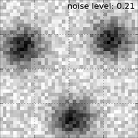
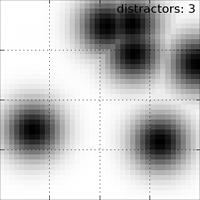
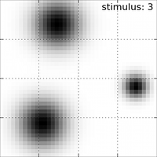
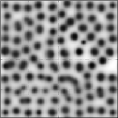
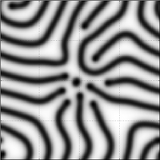
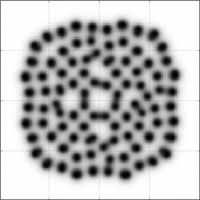
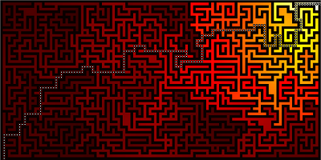

.. include:: header.txt
.. include:: footer.txt

|
|

Here are some examples of the kind of computation you can achieve using the
DANA framework. Be sure to have also a look at the ``examples`` directory as
well as the ``models`` one to get other examples of what can be done with DANA.

Dynamic Neural Fields
=====================

The dynamical neural field (DNF) theory has been introduced by Wilson and
Cowan, and latter formalised by Amari and Taylor. This theory considers a
neural population at the tissue level governed by a unique differential
equation that describe the spatio-temporal evolution of coarse grained
variables such as synaptic or firing rate activity. There have been numerous
theoretical works related to the study of DNF properties like pattern
formation, analytical solution, bifurcation conditions, etc.

More formaly, DNF equation reads:

  1/α ∂u(x,t)/∂t  = -u(x,t) + ∫ w(║y-x║) f(u(y,t))dy  + I(x,t) *(1)*

where:

* u(x,t) is the potential of neural population at position x and time t
* w(d) is a neighborhood function from ℝ→ℝ
* f(u) is the firing rate of a single neuron
* α is the temporal decay of the synapse
* I(x,t) is the input at position x.

It is thus straightforward to  numerically integrate the equation considering a
given spatial  and temporal resolution.

.. code-block:: python

   n = 256
   src = np.zeros((n,))
   tgt = Group((n,), """ dU/dt = (-V + 0.1*L + I);
                             V = maximum(U,0);
                             I; L """)
   SparseConnection(src, tgt('I'), np.ones((1,)))
   SharedConnection(tgt('V'), tgt('L'), +1.10*gaussian(2*n+1, 0.20)
                                        -0.95*gaussian(2*n+1, 1.00))

Gray Scott reaction-diffusion model
===================================

The Gray Scott model is a mathematical model of the reaction and diffusion of
chemical species and may produce a variety of behaviors as illustrated below:

A Gray Scott model is described by a set of two differential equations:

* ∂u/∂t = Du ∇²u - uv² + f(1-u)  (1)
* ∂v/∂t = Dv ∇²v + vu² - (f+k)v  (2)

that can be very easily modeled using DANA:

.. code-block:: python

   Z = Group((n,n), """ du/dt = Du*Lu - Z + F*(1-U)
                        dv/dt = Dv*Lv + Z - (F+k)*V
                        U = np.maximum(u,0)
                        V = np.maximum(v,0)
                        Z = U*V*V
                        Lu; Lv; """)
   K = np.array([[np.NaN,  1., np.NaN], 
                 [  1.,   -4.,   1.  ],
                 [np.NaN,  1., np.NaN]])
   SparseConnection(Z('U'),Z('Lu'), K, toric=True)
   SparseConnection(Z('V'),Z('Lv'), K, toric=True)

|

The full sources for screenshots above are available from the ``models``
directory in the DANA distribution.

Bellman-Ford algorithm
======================

The Bellmann-Ford algorithm can be implemented using DANA as illustrated below: 

The idea is simply to use DANA to diffuse a value and to climb back the ``V``
value to get the shortest path.

.. code-block:: python

   n = 61
   a = 0.99
   Z = 1-maze((n,2*n+1))
   G = Group((n,2*n+1),'''V = I*maximum(maximum(maximum(maximum(V,E),W),N),S)
                          W; E; N; S; I''')
   SparseConnection(Z, G('I'), np.array([ [1] ]))
   SparseConnection(G('V'), G('N'), np.array([ [a],      [np.NaN], [np.NaN] ]))
   SparseConnection(G('V'), G('S'), np.array([ [np.NaN], [np.NaN], [a]      ]))
   SparseConnection(G('V'), G('E'), np.array([ [np.NaN,  np.NaN,  a]        ]))
   SparseConnection(G('V'), G('W'), np.array([ [a,       np.NaN,  np.NaN]   ]))

